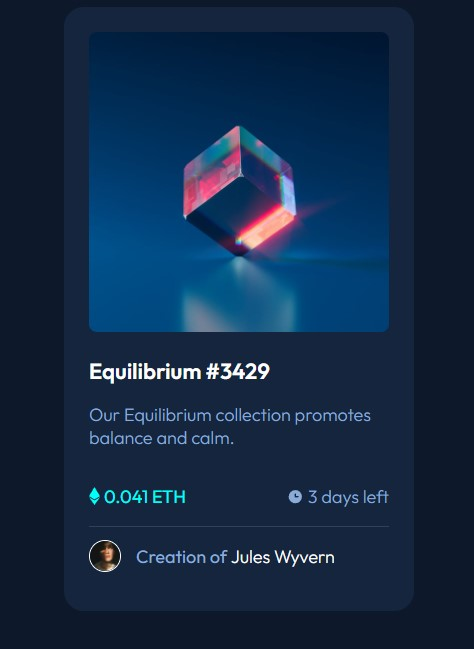
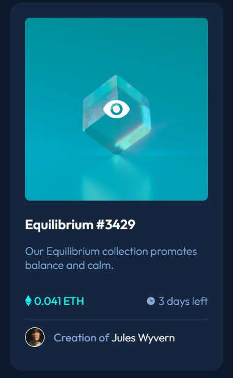

# Frontend Mentor - NFT preview card component solution

This is a solution to the [NFT preview card component challenge on Frontend Mentor](https://www.frontendmentor.io/challenges/nft-preview-card-component-SbdUL_w0U). Frontend Mentor challenges help you improve your coding skills by building realistic projects. 

## Table of contents

- [Overview](#overview)
  - [The challenge](#the-challenge)
  - [Screenshot](#screenshot)
  - [Links](#links)
- [My process](#my-process)
  - [Built with](#built-with)
  - [What I learned](#what-i-learned)
  - [Useful resources](#useful-resources)
- [Author](#author)

## Overview

### The challenge

Users should be able to:

- View the optimal layout depending on their device's screen size
- See hover states for interactive elements

### Screenshot

 


### Links

- Solution URL: [GitHub Repository](https://github.com/Conradicool/fem-nft-card)
- Live Server: [GitHub Pages](https://conradicool.github.io/fem-nft-card/)

## My process

### Built with

- Semantic HTML5 markup
- CSS custom properties
- Flexbox

### What I learned

```css
:root {
    --soft-blue: hsl(215, 51%, 70%);
    --cyan: hsl(178, 100%, 50%);
    --main-dark-blue: hsl(217, 54%, 11%);
    --card-dark-blue: hsl(216, 50%, 16%);
    --line-dark-blue: hsl(215, 32%, 27%);
    --white: hsl(0, 0%, 100%);
}
```
This is the first time that I have use variables in CSS, its was a fun way to learn the basics of them.

```css
.eye-cont {
    position: absolute;
    top: 0;
    left: 0;
    height: 100%;
    width: 100%;
    border-radius: 8px;
    opacity: 0;
    transition: .4s ease;
    background-color: hsl(178, 100%, 50%, 50%);
}

.eye-svg {
    position: absolute;
    top: 50%;
    left: 50%;
    transform: translate(-50%, -50%);
}
```

This was the first time I have used transform within a project, it was very fun to figure out how it worked.

### Useful resources

- [Stack Overflow](https://stackoverflow.com/) - This helped me throughout the project.
- [w3schools](https://www.w3schools.com/default.asp) - This is an amazing website which helped me build the :hover state for the main image.

## Author

- Frontend Mentor - [@Conradicool](https://www.frontendmentor.io/profile/Conradicool)
- GitHub - [Conradicool](https://github.com/Conradicool)
